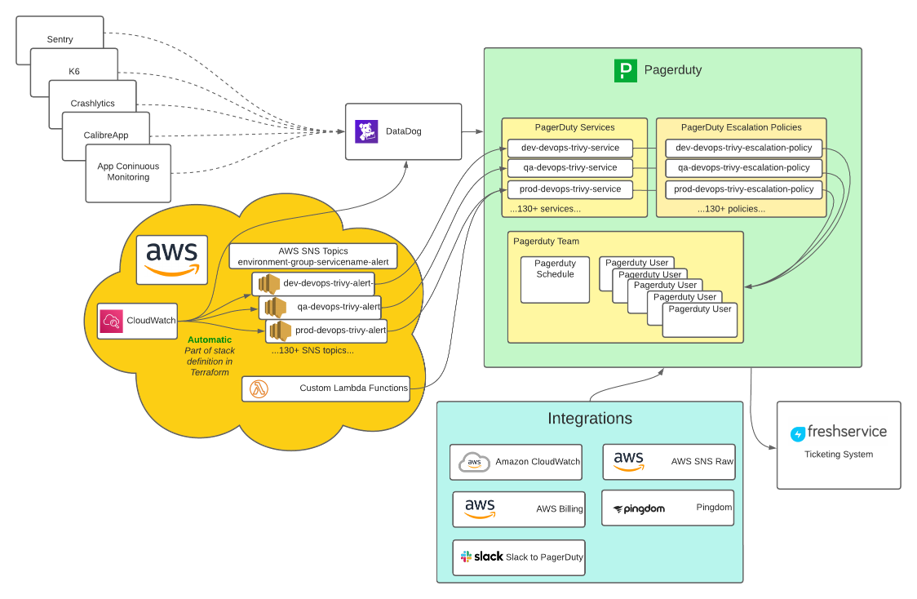
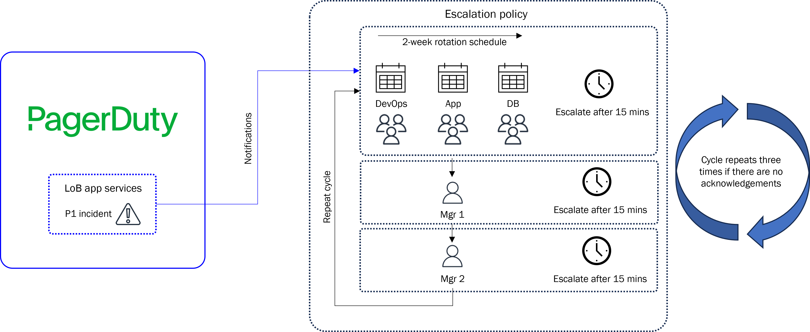
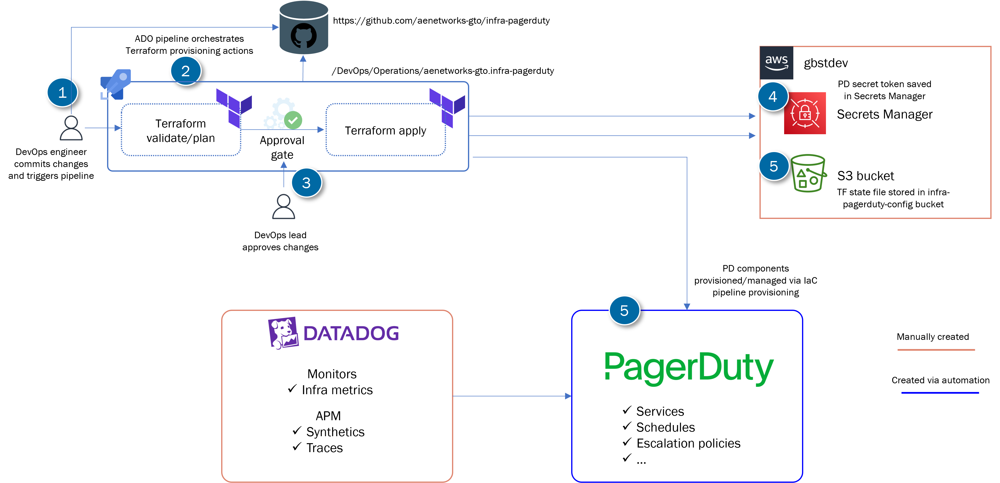

# PagerDuty provisioning 

## Design diagrams







## Contents of this repo

The contents of this repo are intended to provide a means to automate the creation of PagerDuty services and components. 

- The `app-modules` folder contain the code needed to configure individual applications in PagerDuty
- The `common-modules` folder contain code needed to configure common PagerDuty components e.g. Teams, etc. 
- The `plans` folder contain Terraform wrappers/modules that can be used to provision PagerDuty apps and common services
- The `azure-pipelines.yml` contains the ADO pipeline stages and configuration 

    ```console
    .
    ├── tf
    │   ├── app-modules
    |   |   ├── gbst
    |   |   |   ├── data.tf
    |   |   |   ├── main.tf
    |   |   |   ├── output.tf
    |   |   |   ├── terraform.tf
    |   |   |   ├── variables.tf
    |   |   ├── smrs
    |   |   |   ├── data.tf
    |   |   |   ├── main.tf
    |   |   |   ├── output.tf
    |   |   |   ├── terraform.tf
    |   |   |   ├── variables.tf
    |   |   ├── dmg
    |   |   |   ├── data.tf
    |   |   |   ├── main.tf
    |   |   |   ├── output.tf
    |   |   |   ├── terraform.tf
    |   |   |   ├── variables.tf
    │   ├── common-modules
    |   │   ├── data.tf
    |   │   ├── main.tf
    |   │   ├── output.tf
    |   │   ├── terraform.tf
    |   │   └── variables.tf
    │   ├── plans
    |   │   ├── data.tf
    |   │   ├── main.tf
    |   │   ├── output.tf
    |   │   ├── terraform.tf
    |   │   └── variables.tf
    └── azure-pipelines.yml
    └── README.md
    ```

## Requirements

### Prerequisites

Ensure secret is added to Secrets Manager and ARN is added to `data` block as follows:
    ```console
    data "aws_secretsmanager_secret" "pd-secret" {
    arn = "arn:aws:secretsmanager:us-east-1:795345444371:secret:pd-secret-ILYbqF"
    }
    ```

### Deploying PagerDuty services and dependencies

Perform the following steps to provision PagerDuty components:

1. Update variables in `main.tf` under `plans` folder, see below
2. Trigger pipeline

| Variable name | Description |
| --- | --- |
| `pd_secret_value` | The name of the PD API token secrets stored in Secrets Manager |
| `rotation_start` | The rotation start date |
| `rotation_end` | The rotation end date |
| `rotation_virtual_start` | The rotation start date |
| `pd_support_team` | The name of the PD DevOps Support team |
| `pd_app_support_team` | The name of the PD App Support team |
| `oncall_{lob}_devops` | The e-mail addresses of the DevOps Support team members |
| `oncall_{lob}_db` | The e-mail addresses of the DB Support team members |
| `oncall_{lob}_app` | The e-mail addresses of the App team members |
| `pd_{lob}_ep_app_mgr_email` | The e-mail address of the App team escalation primary manager |
| `pd_{lob}_ep_app_mgr2_email` | The e-mail address of the App team escalation secondary manager |
| `pd_schedule` | The DevOps Support team schedule |
| `pd_db_schedule` | The DB Support team schedule |
| `pd_app_schedule` | The App Support team schedule |